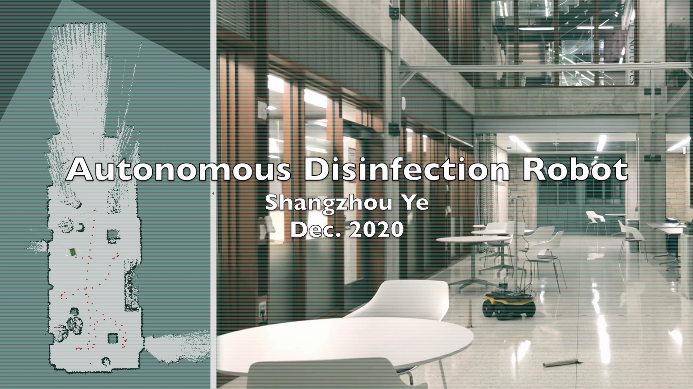

# Autonomous Disinfection Robot

## Demo

[](https://www.youtube.com/watch?v=Hjzabal8oYw)

## Overview

This project built a full-stack disinfection robot with perception, localization, mapping, and navigation capability. The robot is able to classify and localize tables/desks/chairs, as well as to detect and track people in an indoor environment. After a table/desk/chair being used by a human, the robot will approach the table/desk/chair to do the disinfection. Checkout [this post](https://shangzhouye.tech/featured-projects/disinfection_robot/) for a detailed description of this project.

## Dependency

- ROS Melodic, OpenCV 3.2, Eigen, PCL, Scipy, Shapely
- PyTorch 1.6 (https://pytorch.org/get-started/previous-versions/)
- Detectron2 (https://github.com/facebookresearch/detectron2)
- Slam Toolbox (https://github.com/SteveMacenski/slam_toolbox)

## Setup Documentation

- Jackal setup
    - Install these packages on your laptop: `sudo apt-get install ros-melodic-jackal-simulator ros-melodic-jackal-desktop ros-melodic-jackal-navigation`
- Wireless network setup
    - I set up the networking using a local router to get around the complexity of Northwestern WIFI. To start with, connect your laptop, the Jackal robot, and the GPU computer (beast computer) to the router.
    - Navigate to the IP & MAC binding tab on your WiFi router. Bind the MAC address of each computer with a static IP address. The MAC address can be found by `ifconfig` command.
    - After that, set up the resolution of hostname by adding IP & hostname pair to each computer under `/etc/hosts`.
    - For example, on your laptop, add the following block to /etc/hosts.

        ```
        127.0.1.1       your-computer
        192.168.0.105   jackal-desktop
        192.168.0.101   beast
        ```

    - Add the following block to /etc/hosts on jackal (the IP address should be corresponding to the address you bound with).

        ```
        127.0.1.1       jackal-desktop
        192.168.0.100   your-computer
        192.168.0.101   beast
        ```

    - Also on the beast computer, add the following block.

        ```
        127.0.1.1       beast
        192.168.0.100   your-computer
        192.168.0.105   jackal-desktop
        ```

    - Ensure all three computers can ping each other by the host name after this step.
    - Notice that in `.bashrc` on Jackal, the Jackal workspace has been sourced.

        ```
        source /home/jakal/jackal_ws/devel/setup.bash
        ```

    - For ROS to talk, source [`setup_jackal.bash`](./setup_jackal.bash) on the jackal. 

        ```
        export ROS_MASTER_URI=http://jackal-desktop:11311
        export ROS_HOSTNAME=jackal-desktop
        ```

    - Set following variables on your computer. It sets `ROS_MASTER_URI` to the jackal robot.

        ```
        export ROS_MASTER_URI=http://jackal-desktop:11311
        export ROS_HOSTNAME=your-computer
        ```

    - Also on beast computer:

        ```
        export ROS_MASTER_URI=http://jackal-desktop:11311 
        export ROS_HOSTNAME=beast
        ```

    - Type `rostopic list` in command line to check if you can see all the topics on jackal.

- Realsense Setup
    - Install RealSense SDK and ROS wrapper with `sudo apt-get install ros-$ROS_VER-realsense2-camera` and follow this [fix](https://github.com/IntelRealSense/realsense-ros/issues/1426).
  
    - If you need to build from source, install the SDK following this [link](https://github.com/IntelRealSense/librealsense/blob/master/doc/distribution_linux.md#installing-the-packages) and the ROS wrapper following this [link](https://github.com/IntelRealSense/realsense-ros#step-2-install-intel-realsense-ros-from-sources).

- Detectron2 Setup
  - Python 3 is needed for PyTorch and detection2. Follow this [link](https://medium.com/@beta_b0t/how-to-setup-ros-with-python-3-44a69ca36674) to setup Python3 with ROS melodic.

  - Source the compiled `cv_bridge` workspace by `source install/setup.bash --extend`.


## How to Run

Source `setup_*.bash` on each computer.

On beast, source the `cv_bridge` workspace by `source install/setup.bash --extend`

#### Stage 1: 

On the jackal:

`roslaunch jackal-sensor-bringup all.launch`

`roslaunch jackal-rgbd-navigation slam_toolbox_on_jackal.launch`

To stop the robot:

`rostopic pub /move_base/cancel actionlib_msgs/GoalID -- {}`

On your computer:

`roslaunch jackal-rgbd-navigation slam_toolbox_on_pc.launch`

Move the robot to build the map.

Click serialize map (or use the service) to save the map.

Close slam_toolbox and its visualization.

#### Stage 2:

On Jackal:

`roslaunch rgbd_object_detection s2_on_jackal.launch`

It launches slam_toolbox, move_base, map_server and object detection node.

On your computer:

`roslaunch rgbd_object_detection s2_on_pc.launch`

On beast computer:

`rosrun rgbd_object_detection mask_rcnn_v2.py`

Move the robot to each object:

`rosservice call /run_maskrcnn "{}"`

#### Stage 3:

On your computer:

`roslaunch rgbd_object_detection s3_on_pc.launch`